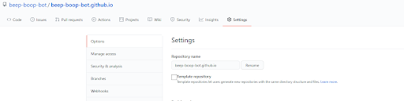
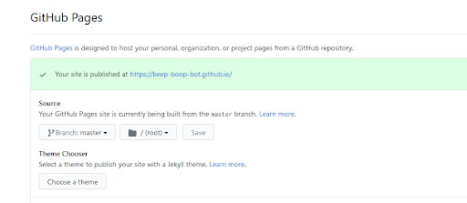

See [workshop.pdf](workshop.pdf) for the presentation

# Motivation

Having a personal website makes you stand out in the sea of other online applications. It's a
way to introduce yourself and control your image to employers online. It's a convenient way to
host a blog, your résumé, and a portfolio. 

# How

- [Hugo](https://gohugo.io/), a static site generator. It takes a chosen theme and your text files and creates the HTML, CSS, and JavaScript files needed to make a nice-looking website.
- [GitHub Pages](https://pages.github.com/), a service that allows you to host a website and its source files for free.

# Why...

GitHub Pages?
- It's free
- It's conveniently compatible with git for version control

Hugo?
- [Markdown](https://github.com/adam-p/markdown-here/wiki/Markdown-Cheatsheet) is really easy to use to write each page of your site. It's much easier than HTML.
- It works well with GitHub Pages

Our [SASE Labs site](https://SASE-Labs-2021.github.io) was generated with Hugo and hosted on GitHub Pages.

# The Setup

1. [Create a GitHub account](https://github.com/join)
2. Get familiar with using the Linux, Mac, or Windows terminal. Just knowing how to list the files in the directory and change directory is okay. We will use text commands on the command line to interact with git, GitHub, and Hugo. 
3. [Install git](https://git-scm.com/downloads). [What is git?](https://github.com/SASE-Labs-2020/tutorials/blob/master/2020-01-30-git-familiar-with-git.md)
4. [Install Hugo](https://gohugo.io/getting-started/installing/##homebrew-linux)
  - Use the above link for MacOS or Linux
  - For Windows, follow [this video](https://youtu.be/G7umPCU-8xc)
    - Make `Hugo` and `Hugo/bin` folders in your C drive
    - Download the Windows zip file [here](https://github.com/gohugoio/hugo/releases)
    - Extract all into your `Hugo/bin` folder
    - Make sure the executable file is named `hugo` or `hugo.exe`
    - Hit the Windows key and search for environment variables
    - Add `C:\Hugo\bin\` to the `Path` environment variable
    - You should now be able to use the `hugo` command in the Windows terminal
5. [Pick a theme](https://themes.gohugo.io/tags/portfolio/)
6. Pick a text editor to use to write your site. I recommend [VSCode](https://code.visualstudio.com/) or [Sublime](https://www.sublimetext.com/).

# Actually making the site

- Read the documentation on your Hugo Theme's page. Make sure to follow any special steps mentioned there not mentioned in this tutorial.
- Type out `hugo new site <your-site-name>`. This will create a directory called `<your-sitename>` with subdirectories including `content`, `static`, and `themes`.
- Check out the GitHub repository for your Hugo theme. Look to its `exampleSite` folder for guidance. Copy the link to the repository and run the command `git clone https://github.com/<your-theme-repo-link> themes/<your-hugo-theme-name>`. This copies the repository into the `themes` folder.
- You should follow the example site for how to write your `config.toml` file
- Typing the command `hugo new <title>.md` creates a new page `<title>.md` in the `content` folder. It will autogenerate a Markdown front matter for you, including the date, title, and other details of the page. 
- Follow the [Markdown cheat sheet](https://github.com/adam-p/markdown-here/wiki/Markdown-Cheatsheet) to write your page below the front matter. My posts normally only consist of headers, code blocks, tables, images, links, and text.
- Make sure you like how your page looks. To see what it will look like before you make the site live, run `hugo serve` or `hugo server` to run the webpage locally. Type 'localhost:1313' in the address bar to see your working version.

# Deploying to GitHub Pages

Use [this guide](https://gohugo.io/hosting-and-deployment/hosting-on-github/) as a reference.

- If you are using Linux, Mac, or WSL, you can start [here](https://gohugo.io/hosting-and-deployment/hosting-on-github/)
- If you are using Windows, instead of running `./deploy.sh` in the final step, you should run `bash -c './deploy.sh'` instead

This will host your site at `<your-github-username>.github.io`. If you'd like yourself to stand out even more, you could purchase a domain name and [use that name with GitHub Pages](https://docs.github.com/en/github/working-with-github-pages/about-custom-domains-and-github-pages).

# Let's create a Toha site

[Toha](https://themes.gohugo.io/toha/) is a Hugo theme for a portfolio site.

- Clone the starter code
```
# the theme is a submodule which refers to another repository
git clone --recurse-submodules https:///github.com/hugo-toha/hugo-toha.github.io
```
- Run the website locally
```
# change directories to the code we just cloned
cd hugo-toha.github.io
# run the development build
hugo server -D
# now type localhost:1313 in your browser's address bar
```
- While the local webserver is running, we can change the website files and see the changes affecting the website live! Notice that the `data/` directory has the content for the main page while the `content/` directory has the content for the blog posts. Edit and customize to your desire!

## Deploying the Toha site

- Create an empty Github repository named `<your-github-username>.github.io`
- Navigate to settings

- Add GitHub pages

- Run the following commands
```
# link the public/ subdirectory to the repo for your website
git submodule add -b main https://github.com/<USERNAME>/<USERNAME>.github.io.git public
# generate the public/ subdirectory
hugo
cd public
# log your changes to git
git add .
git commit -m ‘a helpful message about your website changes’
# push your local changes to GitHub
git push -u origin master
```
- Your website is now live at `<your-github-username>.github.io`!